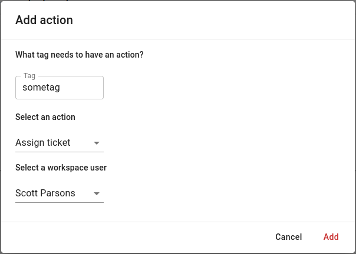

# Actions

## Overview

Do you want DutyCalls to take immediate action after receiving a ticket? Make use of actions. These can be configured per channel per tag.

---

## Actions

### What are actions?

When DutyCalls receives a ticket, it checks whether certain actions need to be addressed first. There are three actions:

* **Silence** - the channel participants will not be notified about this ticket.

* **Assignment** - the ticket will be assigned to a provided workspace user.

* **Auto-close** - the ticket will be closed under the name of a provided workspace user.

How does DutyCalls know when to execute these actions? One or more of these three actions can be configured for a certain tag. When a ticket contains that tag the corresponding actions will be executed.

### How to add and remove an action?

Adding an action is very simple! Just follow the next steps:

1. Navigate to **Channels** > Click the **Settings** button of your desired channel > **Actions** tab > Click on the **+ Add action** button.

    

2. Fill in the form. First of all, you select a tag to which you want to attach actions. Then select the kind of action. In case this involves the action "Assignment" or "Auto-close" you also need to select a workspace user. Finally, click on the **Add** button and the action is now active.

    {: style="width:500px"}

3. After adding of couple of actions, you will see them presented like below. You can easily remove an action by clicking the **Remove** button in the table.

    
