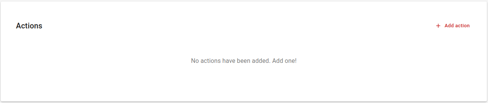
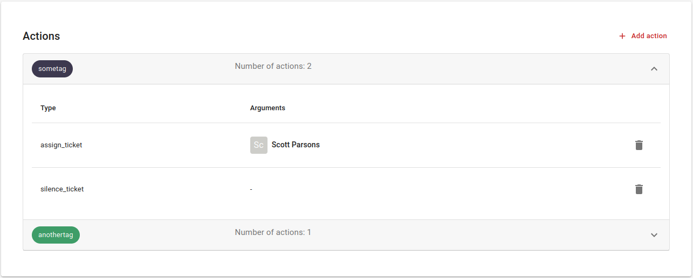

# Configuring actions

Adding an action is very simple! Just follow the next steps:

1. Navigate to **Channels** > Click the **Settings** button of your desired channel > **Actions** tab > Click on the **+ Add action** button.

    

2. Fill in the form. First of all, you select a tag to which you want to attach actions. Then select the kind of action. In case this involves the action "Assignment" or "Auto-close" you also need to select a workspace user. Finally, click on the **Add** button and the action is now active.

    {: style="width:500px"}

3. After adding of couple of actions, you will see them presented like below. You can easily remove an action by clicking the **Remove** button in the table.

    
