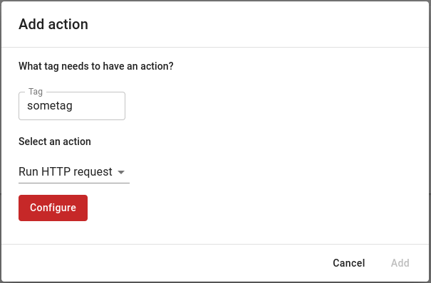
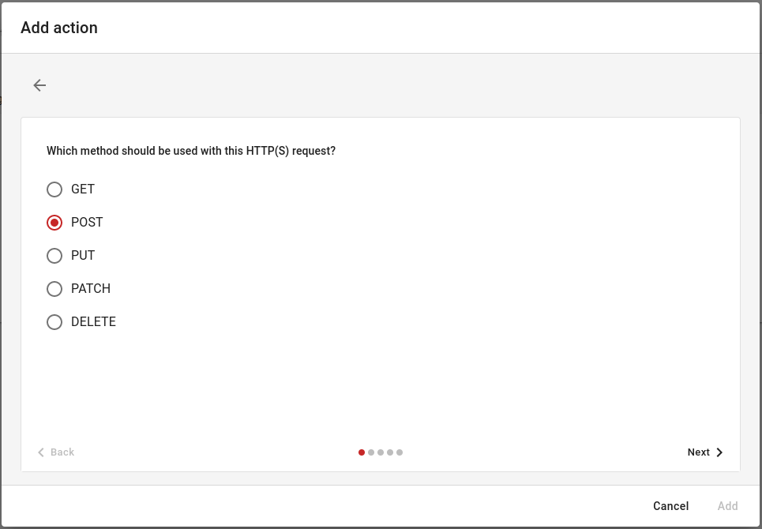
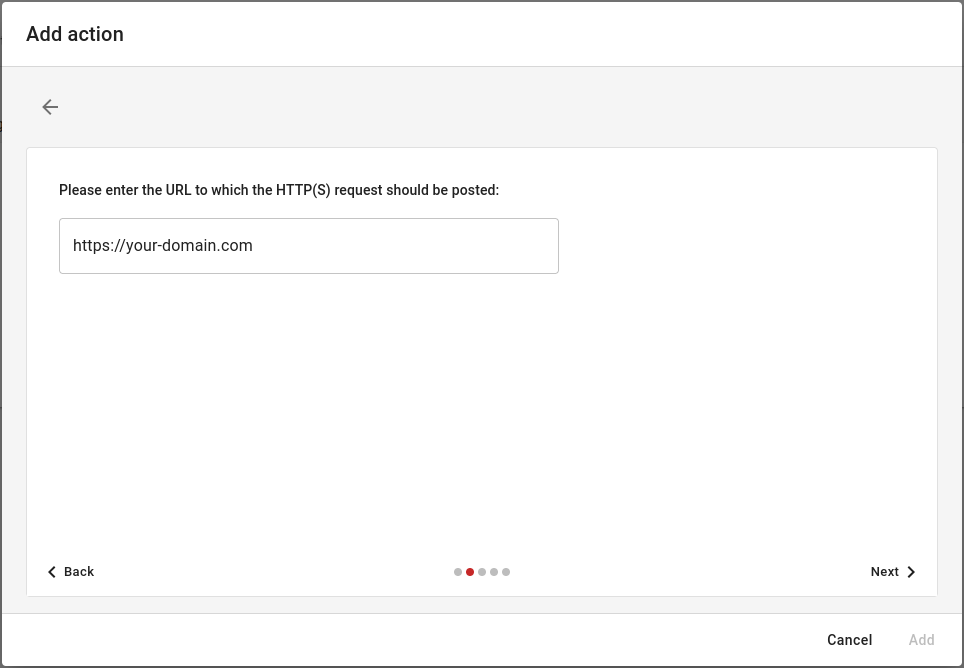
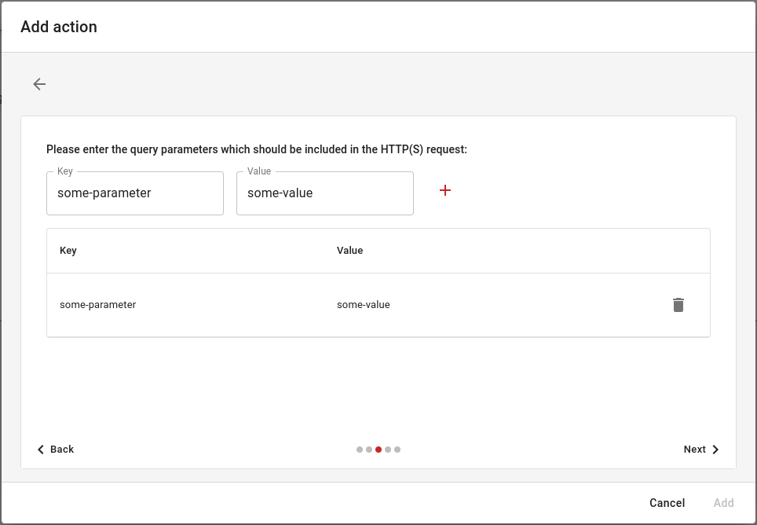
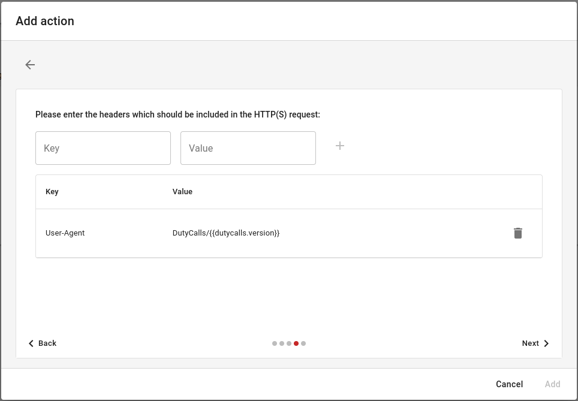
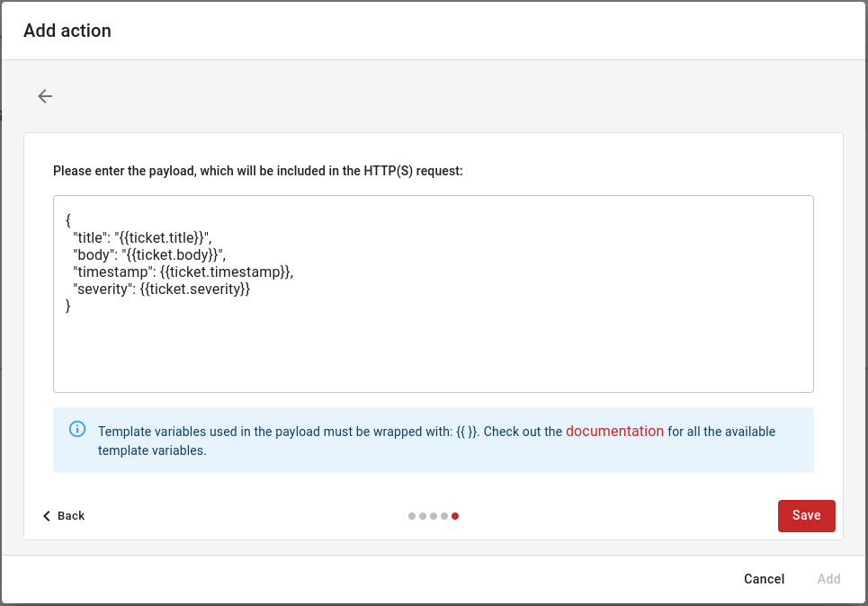
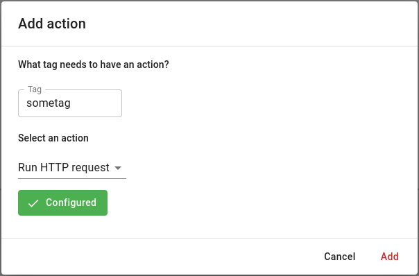

# HTTP(S) requests

## Configuring a HTTP request

When you want to add an action of type **Run HTTP request**, some additional configuration is required. The steps are as follows:

1. Go back to the "Add action" dialog, select a tag to which you want the HTTP request and now select the **Run HTTP request** type.

    

2. When you click on the **Configure** button you will be taken to the HTTP request configurator. Here you can configure exactly the HTTP request that you want to execute when a ticket is received with the tag you specified. The first value you must provide is the HTTP method.

    

3. After that, in the next screen you can specify the URL to which the request has to be sent.

    

4. Then in the next screen you can specify the query parameters that you want to pass to the request.

    

5. In the same way as with the query parameters, you can specify the headers you want to include in the request. By default, the header `User-Agent` is assigned to the request.

    

6. The last step is to add a payload. A default payload is specified by default, but this can be adjusted to your liking. Then click on the **Save** button to save the request.

    

7. Now that the HTTP request is configured, the action can be added to the specified tag. From then on, every time a ticket is received with that tag, the configured request is executed.

    

## Using template variables

DutyCalls also has support for template variables. In every component of the HTTP (except the HTTP method) these variables can be used. This allows DutyCalls to 'inject' relevant data, such as ticket information, into the request prior to sending.

To use template variables, you must use the `{{ }}` syntax. See the example below:

```json
{
  "title": "{{ticket.title}}",
  "body": "{{ticket.body}}",
  "timestamp": {{ticket.timestamp}},
  "severity": {{ticket.severity}}
}
```

### Available template variables

The following variables are available to use:

Variable | Description | Example
---------- | --------------- | ---------------
`dutycalls.version` | DutyCalls version. |`0.13.3`
`ticket.sid` | SID of the ticket. |`aiBzfnJlYWN0LWZpcmViYXNlLWF1dGhlb...`
`ticket.title` | Title of the ticket. |`My ticket`
`ticket.body` | Body of the ticket. |`My ticket body`
`ticket.body_type` | Type of the body of the ticket. |`plain_text`
`ticket.timestamp` | Timestamp of the ticket. |`1623229740`
`ticket.date_time` | Date/time of the ticket in string format. |`2013-02-04T22:44:30.652Z`
`ticket.severity` | Severity of the ticket. |`0.66`
`ticket.sender` | Sender of the ticket. |`me`
`ticket.identifier` | Identifier of the ticket. |`f5cfda01-71a1-4cb8-871c-56d1655c4ea4`
`ticket.channel` | Channel name. |`my-channel`
`ticket.source` | Source name. |`my-source`
