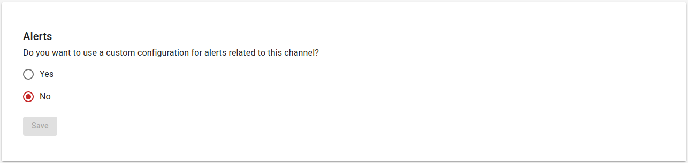
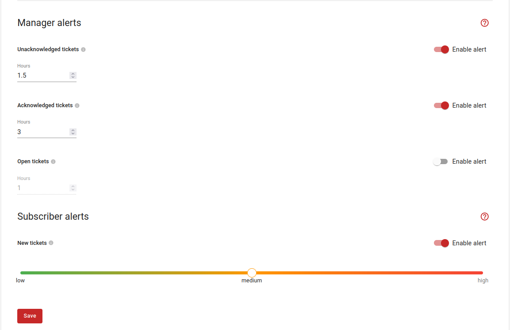

# Configuring alerts

Alerts can be configured specifically for a channel or globally for a workspace. As an example, we show below how this can be done per channel:

1. Navigate to **Channels** > Click the **Settings** button of your desired channel > Select the **Alerts** tab > Click on the **Yes** button to use a custom configuration for alerts related to this channel.

    

2. Set the desired alerts for the current channel and click on the **Save** button to activate the alerts. For more information about the alert types, checkout this [page](alert-types.md).

    

!!! warning
    Alerts configurations specific to a channel override the workspace configuration.
