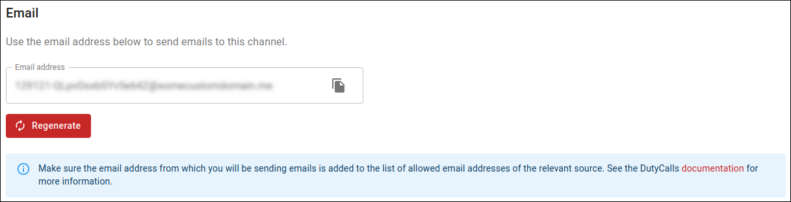

# Email

## Overview

Email can be used for posting tickets to DutyCalls by third parties.

## Email address

Posting tickets to a DutyCalls channel requires a special email address. This email address is unique and can only be used for posting to this channel.

You can find this email address by:

1. Going to the channels page in your workspace.
2. Clicking on the **Settings** button of the relevant channel.
3. Navigating to the **Email** tab.
4. Verifying that you are authorized to access this email address.
5. Copying the email address from the settings dialog.

The only thing left to do, is sending an email!

> **Note:** Make sure the email address from which you will be sending emails is added to the list of allowed email addresses of the relevant source.
