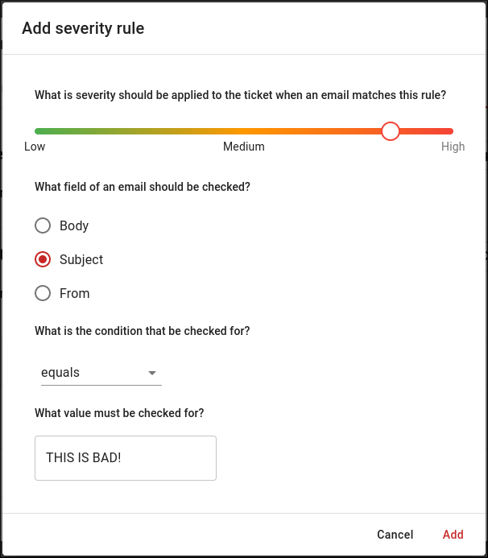

# Email

## Overview

Email can be used for posting tickets to DutyCalls by third parties.

---

## Email address

Posting tickets to a DutyCalls channel requires a special email address. This email address is unique and can only be used for posting to this channel.

You can find this email address by:

1. Going to the channels page in your workspace.
2. Clicking on the **Settings** button of the relevant channel.
3. Navigating to the **Email** tab.
4. Verifying that you are authorized to access this email address.
5. Copying the email address from the settings dialog.

    

The only thing left to do, is sending an email!

> **Important:** You should store this email address in a secure location. It is important to keep your credentials confidential to protect your account.

---

## Allowed email addresses

Before sending an email it is important to add the email address to the list of allowed email addresses. Otherwise DutyCalls will ignore mails from this email address.

You can add your email address by:

1. Going to the sources page in your workspace.
2. Clicking on the **Edit** button of the relevant channel.
3. Navigating to the **Email** tab.
4. Opening the **Allowed email addresses** panel.
5. Add your email address to the list of allowed email addresses.

    

---

## Severity rules

Do you need to link a severity to your emails? This is possible by adding severity rules.

You can add severity rules by:

1. Going to the sources page in your workspace.
2. Clicking on the **Edit** button of the relevant channel.
3. Navigating to the **Email** tab.
4. Opening the **Severity rules** panel.
5. Clicking on the **Add rule** button.

    {: style="width:500px"}

6. The last step is to indicate which severity should be assigned to mails with which characteristics.

    {: style="width:500px"}
