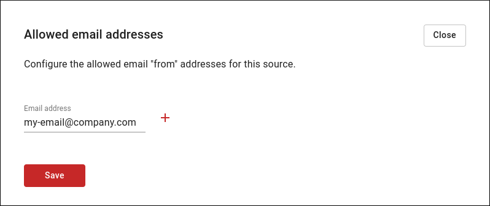

# Allowed email addresses

Before sending an email it is important to add the sender's email address to the list of allowed email addresses. Otherwise DutyCalls will ignore mails from this email address.

You can add your email address by:

1. Going to the **Sources** page in your workspace.
2. Clicking on the **Edit** button of the relevant channel.
3. Navigating to the **Email** tab.
4. Opening the **Allowed email addresses** panel.
5. Add your email address to the list of allowed email addresses.

    
