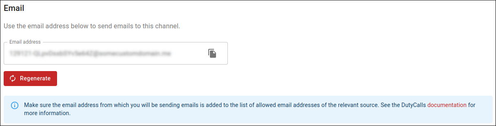

# Email address

Posting tickets to a DutyCalls channel requires a special email address. This email address is unique and can only be used for posting to this channel.

You can find this email address by:

1. Going to the **Channels** page in your workspace.
2. Clicking on the **Settings** button of the relevant channel.
3. Navigating to the **Email** tab.
4. Verifying that you are authorized to access this email address.
5. Copying the email address from the settings dialog.

    

The only thing left to do, is sending an email!

!!! warning
    You should store this email address in a secure location. It is important to keep your credentials confidential to protect your account.
