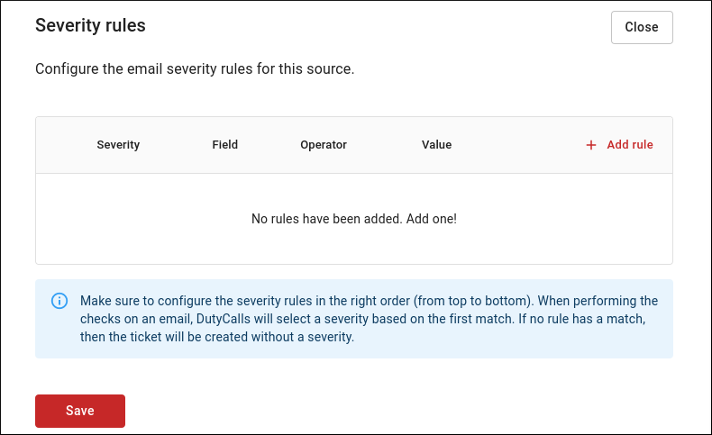
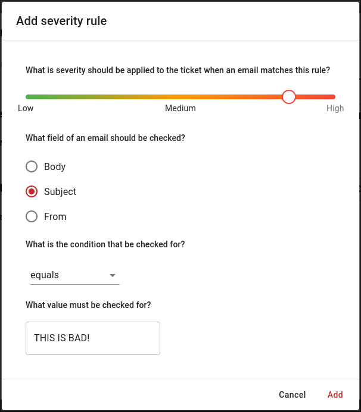

# Severity rules

Do you want to add a severity to your emails? This is possible by configuring severity rules.

You can configure severity rules by:

1. Going to the **Sources** page in your workspace.
2. Clicking on the **Edit** button of the relevant channel.
3. Navigating to the **Email** tab.
4. Opening the **Severity rules** panel.
5. Clicking on the **Add rule** button.

    {: style="width:500px"}

6. The last step is to indicate which severity should be assigned to mails with which characteristics.

    {: style="width:500px"}
