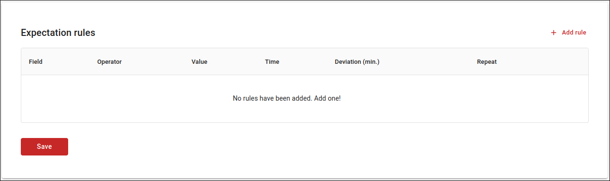
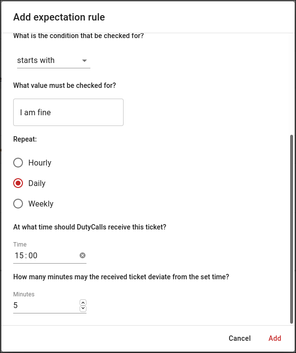
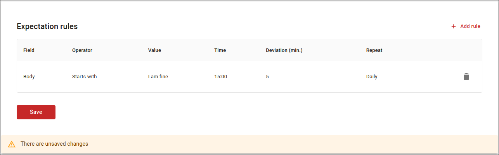

# Expectation rules

## What are expectation rules?

Expectation rules ensure that when a certain ticket is not received that is expected, an alert will be raised. These rules define which characteristics a ticket must have, at what time it is expected and how often the check must be performed.

---

## How to add an expectation rule?

Adding an expectation rule is very simple! Just follow the next steps:

1. Navigate to **Channels** > Click the **Settings** button of your desired channel > Select the **Expectations** tab > Click on the **+ Add rule** button to add a new expecation rule.

    

2. Fill in the form. First of all, you define the characteristics of the ticket you expect. For example, you might expect a ticket with a `body` that starts with `"I am fine"`. Then you indicate how often this check should be performed. Finally, enter the time you expect the ticket with an associated deviation. Click on the **Add** button to add the rule.

    {: style="width:500px"}

3. Click on the **Save** button, when you are done adding expectation rules, to save them to DutyCalls. The expectation rules are now active.

    
