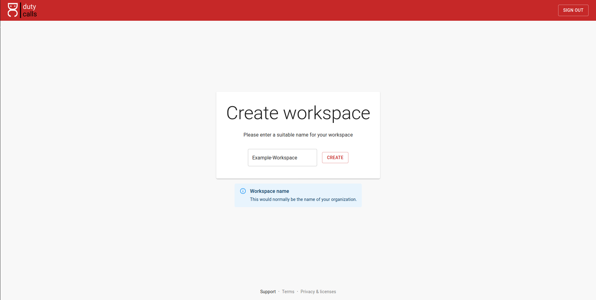
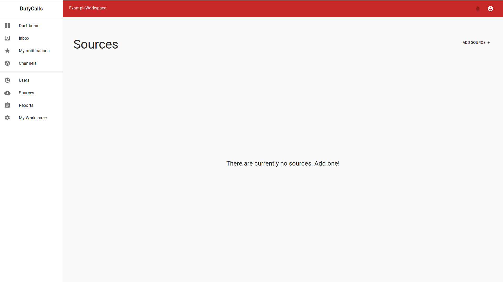
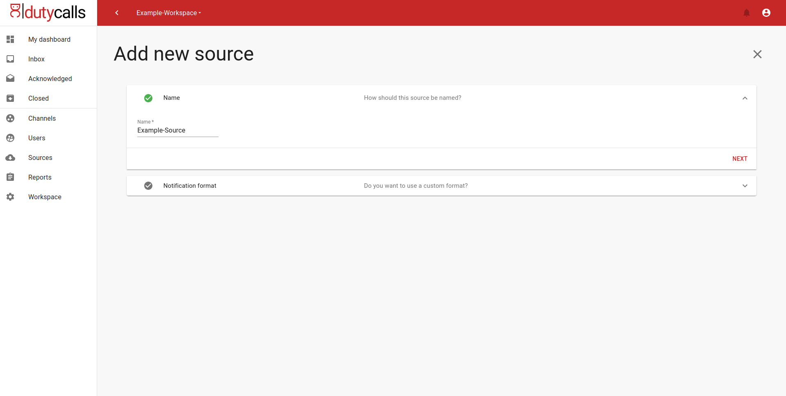
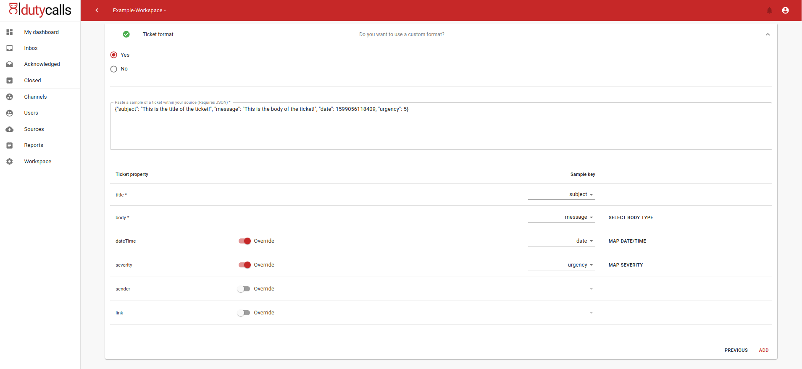
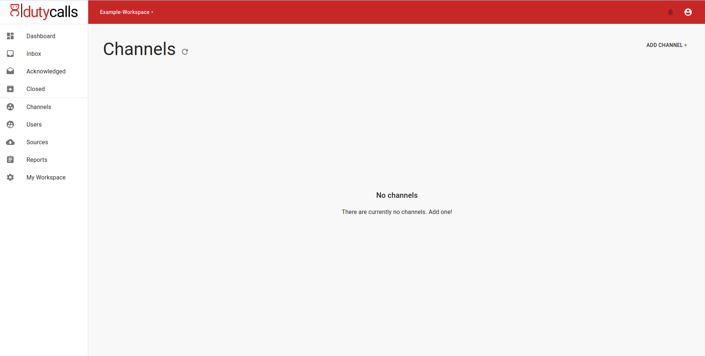
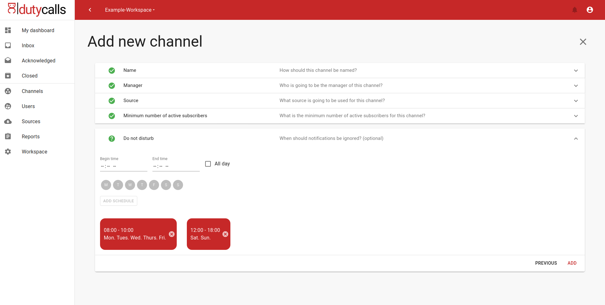
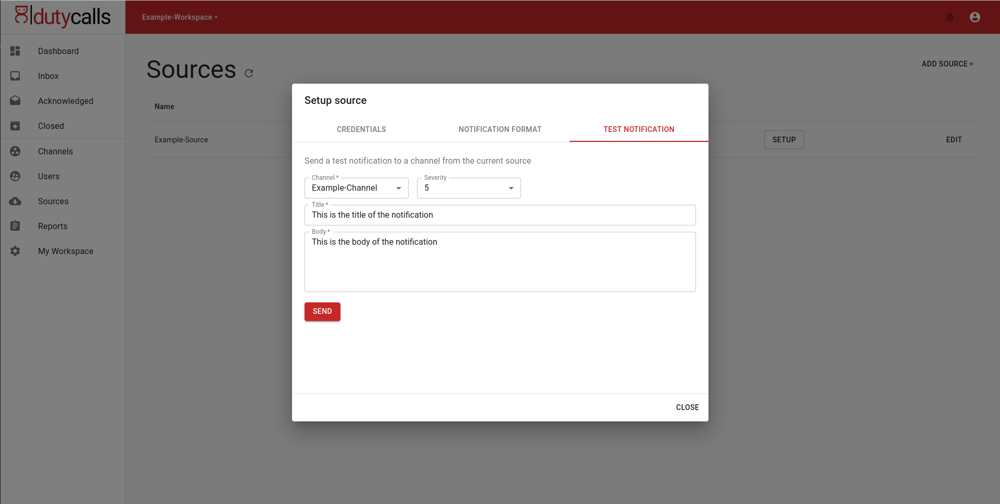

# Getting started

## Overview

To start making use of our great product there are a few things that need to be done before any notification can be received by DutyCalls. These things are thoroughly described in the following steps.

## Step 1 - Create a workspace

### What is a workspace?

A workspace is a place where everything is done. As a user you have to be a member of a workspace to make use of the functionalities of DutyCalls. A workspace often represents a company or department. There are two ways of joining a workspace. You can get invited to one and you can create one yourself.

How can I create a workspace? That is very simple. Just sign in to DutyCalls and select the **Create workspace** card.

Now enter a unique name for your workspace, click on the **Create** button and voila. Your workspace has been created.

## Step 2 - Add a source

After you have signed in to your workspace, you have to add a source.

### What is a source?

A source is literally the source from where you receive notifications. It is probably the system that you want to connect to DutyCalls. You do not actually have to connect your system to DutyCalls, as it uses a REST API. But you must indicate what you are going to send. Notifications can be sent in any format and DutyCalls needs to now how it should interpret these notifications. So a source is actually a mapping between DutyCalls and another system.

To add a source you have to go to the sources page, click here on the **Add source** button.

Here you will be asked for a name and optionally for a sample of a notification. This depends on whether you want to send notifications with a custom format or not.

A sample is just an example of a notification (must be valid JSON) from the system that you want to connect to DutyCalls. After pasting it, you can map all or your keys / values to the corresponding properties of a notification within DutyCalls. Lastly, click on the **Add** button and the source will be added to your workspace.

As a result, DutyCalls knows how to use and display your notification. When defining a custom format, it is not mandatory to override all properties of a notification. It may of course be possible that, for example, you do not have to show a link in a notification or no severity is included in a notification. There are, however, two mandatory properties. These are: `title` and `body`.

## Step 3 - Add a channel

The next logical step is to add a channel.

### What is a channel?

A channel can be seen as a path a notification follows after being sent. All of the notifications from all of the sources that provide the same `channelName` will gather here. When sending a notification to DutyCalls, it is mandatory to provide the name of at least one channel. Users will be able to subscribe to these channels, which ensures that they will receive these notifications.

To add a channel. Go to the channels page and click on the **Add channel** button.

You will have to fill in the following information:

* Name: The name of the new channel.
* Manager: A manager is ultimately responsible person within a channel and will, among other things, receive warnings when something is wrong within a channel. Every user within a workspace can be designated as a manager of a channel.
* Source: By selecting the source, the channel knows from which source it must receive notifications.
* Minimum subscribers: A minimum number of subscribers have to be defined. If this minimum is not reached, a warning will be raised.
* Schedules: Schedules or rather 'ignore schedules' are used to indicate when you do not want the channel to receive notifications. This does not have to be done immediately and can always be added / adjusted at a later stage. (optional)

Now click on the **Add** button and the new channel will be added to your workspace.

## Step 4 - Send a test notification

To check if everything is set up properly, go back to the sources page and click on the **Setup** button of the source that you have just added.
A dialog now shows up. Click on the second tab called **Test Notification** and you are ready to send a test notification. Just fill in the required fields
and click on the **Send** button. If all is well, you should now see a notification in the inbox.

> Note: The `title` of a notification could be part of push notifications, emails, text messages being send by DutyCalls, which will be truncated when being too long. If you want to make sure that notification titles are displayed correctly, stick to a maximum of `50` characters.  

## Where to next?

Now that you have set up your workspace, you might want to check out these resources.

* Our [REST API Reference documentation](rest-api.md)
