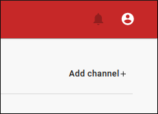

# Step 3 - Add a channel

The next logical step is to add a channel.

---

## What is a channel?

A channel can be seen as a path a ticket follows after being sent. All of the tickets from all of the sources that provide the same `channel` will gather here. When posting a ticket to DutyCalls, it is mandatory to provide the name of at least one channel. Users will be able to subscribe to these channels, which ensures that they will receive these tickets.

---

## Configuration

To add a channel. Go to the channels page and click on the **Add channel** button.

You will have to fill in the following information:

- Name: The name of the new channel.
- Manager: A manager is ultimately responsible person within a channel and will, among other things, receive warnings when something is wrong within a channel. Every user within a workspace can be designated as a manager of a channel.
- Source: By selecting the source, the channel knows from which source it must receive tickets.
- Minimum subscribers: A minimum number of subscribers have to be defined. If this minimum is not reached, a warning will be raised.
- Schedules: Schedules or rather 'ignore schedules' are used to indicate when you do not want the channel to receive tickets. This does not have to be done immediately and can always be added / adjusted at a later stage. (optional)

Now click on the **Add** button and the new channel will be added to your workspace.

