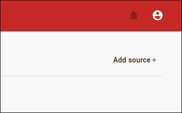
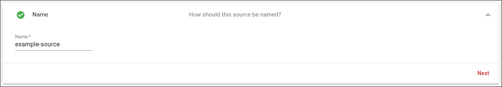
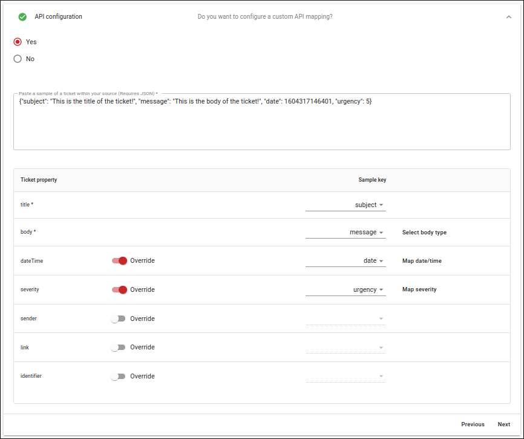
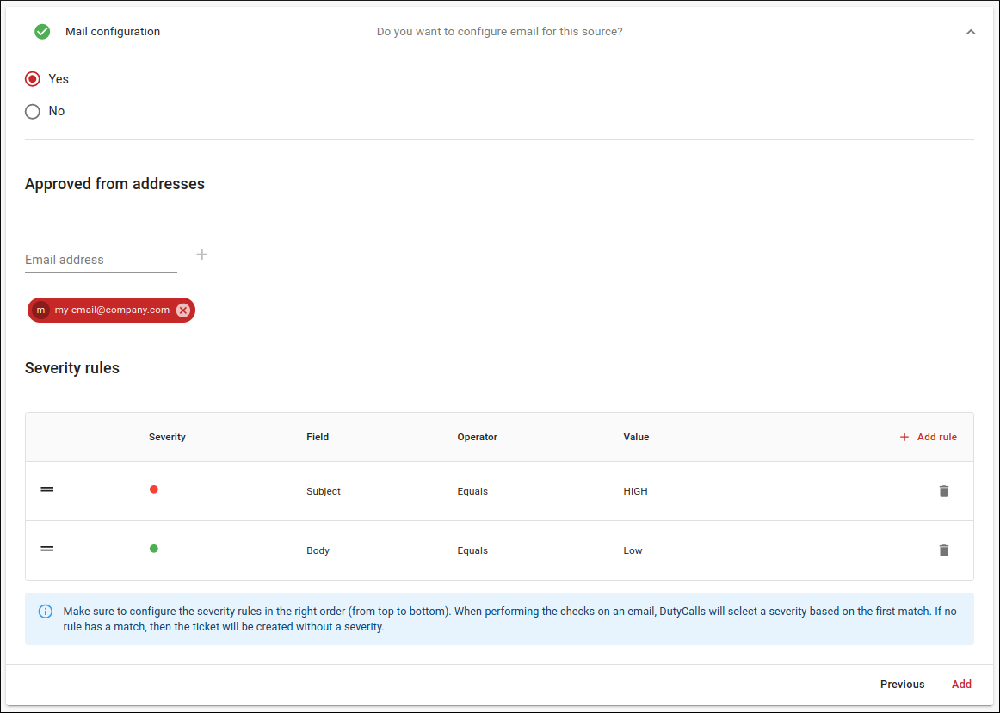

# Step 2 - Add a source

After you have signed in to your workspace, you have to add a source.

---

## What is a source?

A source is literally the source from where you receive tickets. It is probably the system that you want to connect to DutyCalls. You do not actually have to connect your system to DutyCalls, as it uses a REST API. But you must indicate what you are going to post. Tickets can be posted in any format and DutyCalls needs to now how it should interpret these tickets. So a source is actually a mapping between DutyCalls and another system.

---

## Configuration

To add a source you have to go to the sources page, click here on the **Add source** button.

Here you will be asked for a name and optionally for a REST API and email configuration. This depends on whether you want to post tickets with a custom format or not.

In the REST API configuration you will be asked for a sample of a ticket. A sample is just an example of a ticket/message (must be valid JSON) from the system that you want to connect to DutyCalls. After pasting it, you can map all or your keys / values to the corresponding properties of a ticket within DutyCalls. As a result, DutyCalls knows how to use and display your ticket. When defining a custom format, it is not mandatory to override all properties of a ticket. It may of course be possible that, for example, you do not have to show a link in a ticket or no severity is included in a ticket. There are, however, two mandatory properties. These are: `title` and `body`.

The next optional step is to configure the mail for this source. The things to enter here are valid email addresses from where emails may be sent to DutyCalls and the rules to be assigned to determine the severity of an email sent to DutyCalls.

Lastly, click on the **Add** button and the source will be added to your workspace.
