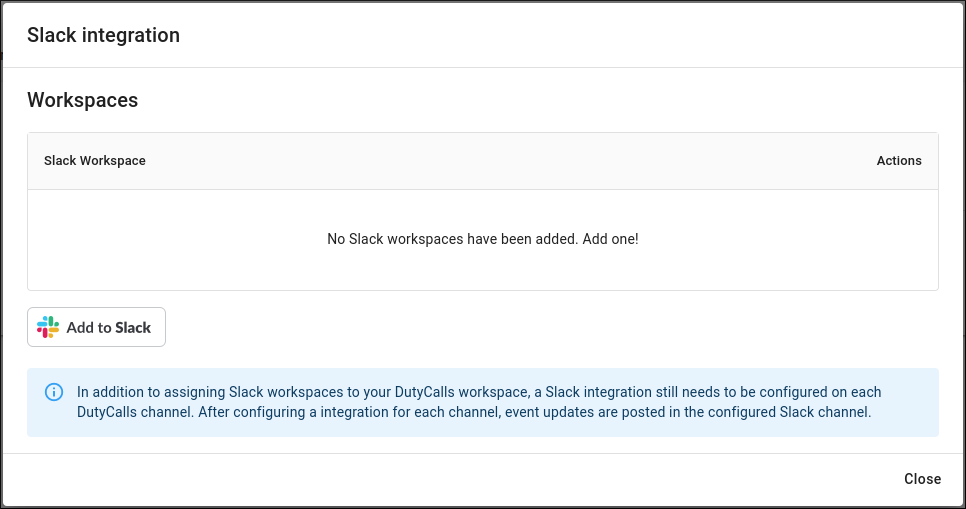
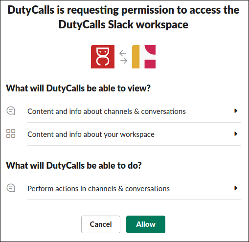

# Integrations

## Overview

All kinds of applications are or can be integrated with DutyCalls. This way we can provide your organization with as much functionality as possible without having to stop using your current applications. Below you can see how you can integrate your favorite application(s) with DutyCalls.

## Slack

Do you want to stay informed of the latest DutyCalls updates directly in Slack? Make use of the ready-made Slack integration.

### Initial Configuration

To begin the integration and eventually make use of the Slack integration, you will need to map your DutyCalls Workspace to your Slack Workspace.

1. Head over to **Workspace** and select the **Integrations** tab.
2. Select the **Add** button next to Slack.
{: style="width:750px"}

3. On the Slack configuration dialog, click on the **Add to Slack** button to link your DutyCalls workspace to your Slack workspace. Linking your DutyCalls workspace to your Slack workspace guarantees that the DutyCalls bot is available in Slack.
{: style="width:750px"}

4. After clicking the button, you will be directed to a Slack authorization screen where you can authorize the DutyCalls Slack App to perform the following actions:
{: style="width:500px"}

Click on the **Allow** button to authorize. When this step is finished, you are able to start adding the Slack integration to your DutyCalls channels.

### Add the Slack Integration to a Channel

Now that a Slack workspace has been mapped to your DutyCalls workspace, something else needs to be done before messages (event updates) are posted to Slack and that is adding a channel integration.

1. Navigate to **Channels** > Click the **Settings** button of your desired channel > **Integrations** tab > Click on the **+** button to add a new integration.

2. Select **Slack** from the dropdown list. Enter a friendly **Name** for the integration. This could be anything. After that, select the correct Slack **Workspace** and the desired Slack **Channel**. Lastly, select the events from which you want to receive updates for.
{: style="width:500px"}

The configuration has now been completed. Event updates related to the configured DutyCalls channel will be posted in the selected Slack channel.

## Generic webhook

Do you have another application that you would like to integrate with DutyCalls? Add a *Generic Webhook*!

### Add the Generic Webhook to a Channel

The only requirement for this form of integration is that you have a valid webhook URL to which DutyCalls can post event updates.

1. Navigate to **Channels** > Click the **Settings** button of your desired channel > **Integrations** tab > Click on the **+** button to add a new integration.

2. Select **Generic Webhook** from the dropdown list. Enter a friendly **Name** for the integration. This could be anything. After that, enter the webhook URL. Lastly, select the events from which you want to receive updates for.
{: style="width:500px"}

3. DutyCalls event updates will be send using a `HTTP` `POST` request, with as body a `JSON` object with the following format:
```json
{
    "text": "A message describing the event."
}
```

The configuration has now been completed. Event updates related to the configured DutyCalls channel will be posted to the configured application.
