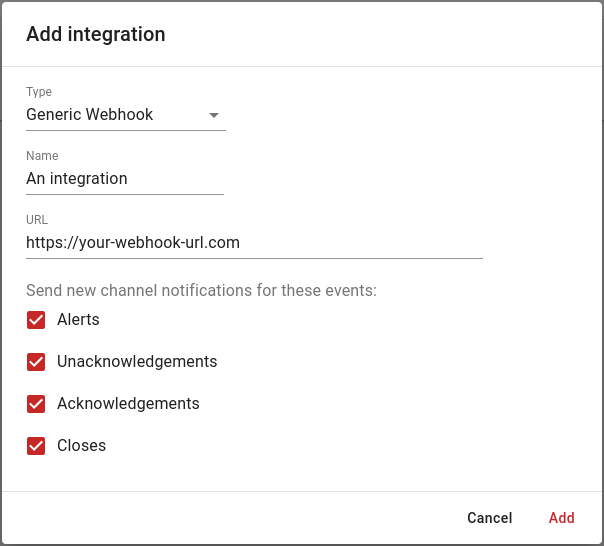

# Generic webhook

Do you have another application that you would like to integrate with DutyCalls? Add a *Generic Webhook*!

---

## Add the Generic Webhook to a channel

The only requirement for this form of integration is that you have a valid webhook URL to which DutyCalls can post event updates.

1. Navigate to **Channels** > Click the **Settings** button of your desired channel > **Integrations** tab > Click on the **+** button to add a new integration.

2. Select **Generic Webhook** from the dropdown list. Enter a friendly **Name** for the integration. This could be anything, as long as it clarifies what integration is involved. After that, enter the webhook URL. Lastly, select the events from which you want to receive updates for.

    {: style="width:500px"}

3. DutyCalls event updates will be send using a `HTTP` `POST` request, with as body a `JSON` object with the following format:

```json
{
    "title": "Title of the event message",
    "text": "A message describing the event.",
    "url": "A HTTPS URL that points towards the relevent page in the application."
}
```

The configuration has now been completed. Event updates related to the configured DutyCalls channel will be posted to the configured application.
