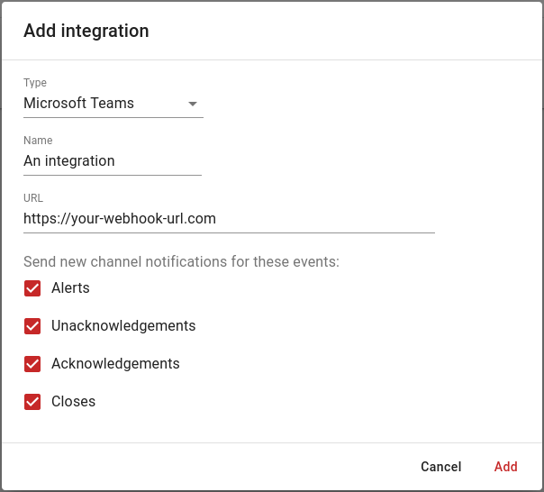

# Microsoft Teams

Do you want to stay informed of the latest DutyCalls updates directly in Microsoft Teams? Make use of the ready-made Microsoft Teams integration.

---

## Initial Configuration

To begin the configuration and eventually make use of the Microsoft Teams integration, you will need to add the DutyCalls connector to your desired Microsoft Teams channel.

1. Head over to the desired channel in Microsoft Teams, click on the ellipses next to it and select **Connectors** from the dropdown.

    {: style="width:750px"}

2. A new dialog will appear. Now search for the DutyCalls connector and click on the **Add** button next to it.
3. On the DutyCalls connector configuration page, enter a name for your DutyCalls connection and click on the **Create** button.

    {: style="width:500px"}

4. Then copy the **Webhook URL**. (You will need this later)

    {: style="width:500px"}

Click on the **Save** button to activate the connection. When this step is finished, you are able to start adding the Microsoft Teams integration to your DutyCalls channels.

---

## Add the Microsoft Teams integration to a channel

Now that the DutyCalls connector has been configured on a Microsoft Teams channel, something else needs to be done before messages (event updates) are posted to Microsoft Teams and that is adding a channel integration within DutyCalls.

1. Navigate to **Channels** > Click the **Settings** button of your desired channel > **Integrations** tab > Click on the **+** button to add a new integration.

2. Select **Microsoft Teams** from the dropdown list. Enter a friendly **Name** for the integration. This could be anything, as long as it clarifies what integration is involved. After that, enter the **URL** you copied earlier. Lastly, select the events from which you want to receive updates for.

    {: style="width:500px"}

The configuration has now been completed. Event updates related to the configured DutyCalls channel will be posted in the configured Microsoft Teams channel.
