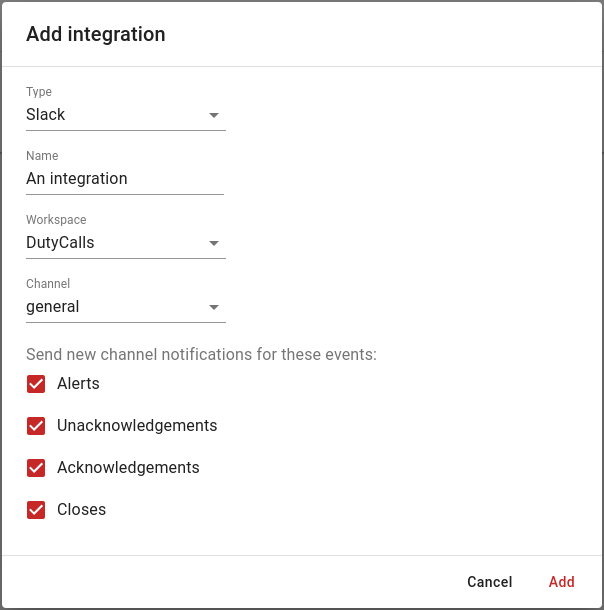

# Slack

Do you want to stay informed of the latest DutyCalls updates directly in Slack? Make use of the ready-made Slack integration.

---

## Initial Configuration

To begin the configuration and eventually make use of the Slack integration, you will need to map your DutyCalls workspace to your Slack workspace.

1. Head over to **Workspace** and select the **Integrations** tab.
2. Select the **Add** button next to Slack.

    {: style="width:750px"}

3. On the Slack configuration dialog, click on the **Add to Slack** button to link your DutyCalls workspace to your Slack workspace. Linking your DutyCalls workspace to your Slack workspace guarantees that the DutyCalls bot is available in Slack.

    {: style="width:750px"}

4. After clicking the button, you will be redirected to a Slack authorization screen where you can authorize the DutyCalls Slack App to perform the following actions:

    {: style="width:500px"}

Click on the **Allow** button to authorize. When this step is finished, you are able to start adding the Slack integration to your DutyCalls channels.

---

## Add the Slack integration to a channel

Now that a Slack workspace has been mapped to your DutyCalls workspace, something else needs to be done before messages (event updates) are posted to Slack and that is adding a channel integration within DutyCalls.

1. Navigate to **Channels** > Click the **Settings** button of your desired channel > **Integrations** tab > Click on the **+** button to add a new integration.

2. Select **Slack** from the dropdown list. Enter a friendly **Name** for the integration. This could be anything, as long as it clarifies what integration is involved. After that, select the correct Slack **Workspace** and the desired Slack **Channel**. Lastly, select the events from which you want to receive updates for.

    {: style="width:500px"}

The configuration has now been completed. Event updates related to the configured DutyCalls channel will be posted in the selected Slack channel.
