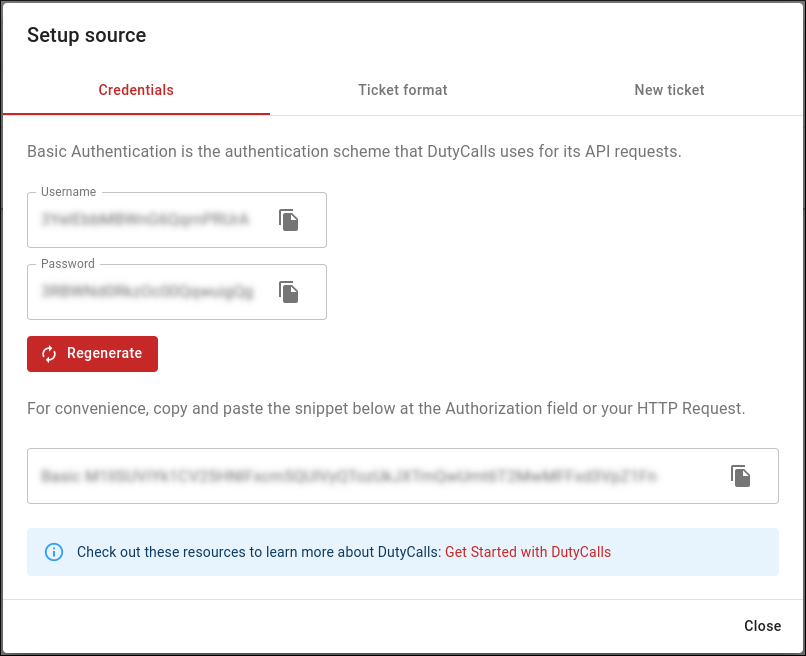

# REST API

## Overview

A REST API is used for accessing and manipulating data within DutyCalls by third parties.

## Authentication

All API calls require authentication. The authentication scheme we use for HTTP requests, is Basic Authentication. In every request a combination of a username (consumerKey) and a password (consumerSecret) must be provided. It is also possible to provide the following `Authorization` header: `Basic <credentials>` in a request. Where credentials is a base64-encoded string of `username:password`.

You can find these credentials by:

1. Going to the sources page in your workspace.
2. Clicking on the **Setup** button of the relevant source.
3. Verifying that you are authorized to access these credentials.
4. Copying the relevant credentials from the setup dialog.



> **Important**: You should store your credentials in a secure location. It is important to keep your credentials confidential to protect your account.

## Example

In addition to the credentials and the data itself, the name or names of the targeted channels must also be included in the HTTP request. These can be added as the value of the query parameter `channel` in the URI of the request. An example of this can be seen below.

```curl
curl -X POST "https://dutycalls.me/api/notification?channel=Example-Channel"
    -H  "accept: application/json"
        -H  "Content-Type: application/json"
            -d {
                    "subject": "This is the title of the notification",
                    "message": "This is the body of the notification",
                    "date": 1582711182342,
                    "urgency": 5
                }
```

> Note: The `Authorization` header in in the HTTP request above is still missing and will have to be added in order to post a notification.

## API specifications and testing

For user-friendliness, we have documented and hosted the API specifications in [Swagger](https://app.swaggerhub.com/apis-docs/robbm1/DutyCalls). Besides the easy of use, this also makes it very easy for you to manually test our API.
