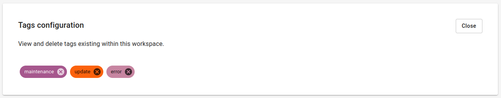

# Using tags

## Adding tags

Tags can be simply added to tickets by adding the tags property when posting tickets via the [REST API](rest-api.md).

---

## Configuring tags

Tags can be configured workspace wide. When previously unexisting tags are received by DutyCalls these will automatically be added to the workspace. You can find these tags by:

1. Going to the **Workspace** settings page in your workspace.
2. Selecting the **Tags** tab.

    

Here you can view the tags used in the workspace and delete them if necessary.
